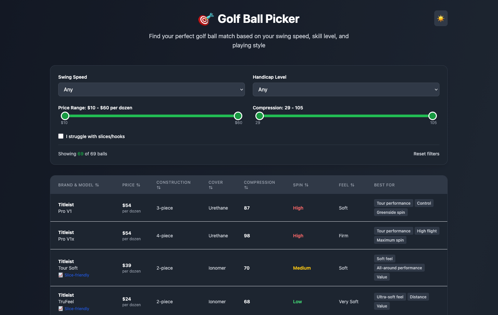

# Golf Ball Picker

A clean, interactive web tool to help golfers find their perfect golf ball match based on swing speed, handicap, price, compression, and playing style. Features sortable comparison table, dual-range sliders, and auto dark mode.



## What It Does

Golf Ball Picker helps you discover the right golf ball for your game by filtering through a comprehensive database of current models from major brands (Titleist, Callaway, TaylorMade, Bridgestone, Srixon, Wilson, Vice, Maxfli, and more).

### Key Features

**Smart Filtering:**
- **Swing Speed** - Select from Low (<85mph), Medium (85-95mph), High (95-110mph), or Very High (110+mph)
- **Handicap Level** - Filter by Low (0-9), Mid (10-20), or High (20+)
- **Price Range** - Dual-slider to set your budget ($10-$60 per dozen)
- **Compression Range** - Fine-tune based on your preference and swing characteristics
- **Slice-Friendly** - Checkbox to show only balls that help reduce sidespin

**Easy Comparison:**
- Click any column header to sort (Brand, Price, Construction, Cover, Compression, Spin, Feel)
- Clean table layout shows all specs side-by-side
- Color-coded spin levels (red=high, orange=medium-high, yellow=medium, green=low)
- Slice-friendly indicator for each ball

**Automatic Dark Mode:**
- Detects your system theme preference
- Manual toggle available (sun/moon icon)
- Full dark mode styling throughout

**Educational Info:**
- Built-in explanations of compression, spin, construction, and cover materials
- Helps you understand what each specification means for your game

## How It Works

### User Experience

1. **Open the HTML file** in any modern web browser (Chrome, Firefox, Safari, Edge)
2. **Set your preferences** using the filter dropdowns and sliders at the top
3. **Browse results** in the table below - all matching golf balls appear instantly
4. **Sort columns** by clicking headers to compare specs
5. **Reset anytime** with the "Reset filters" button

The interface updates in real-time as you adjust filters - no page reloads needed.

### Code Structure

This is a **single-file application** built with vanilla JavaScript - no frameworks, no build process, just open and run.

#### Main Components

**HTML Structure:**
```
golf-ball-picker.html
├── <head> - Tailwind CSS CDN, custom styles for sliders and sorting
└── <body>
    ├── Loading state
    └── <script> - All application logic
```

**JavaScript Architecture:**

1. **Data Layer** (lines ~30-50)
   - `csvData` - Golf ball database in CSV format (PASTE YOUR DATA HERE)
   - `parseCSV()` - Converts CSV string to JavaScript objects
   - Handles pipe-separated values (e.g., "Low|Medium" for multiple swing speeds)

2. **State Management** (lines ~52-62)
   - Single `state` object tracks all filters and UI state
   - `darkMode` - Theme preference
   - `sortColumn` & `sortDirection` - Current table sort
   - Filter values: `swingSpeed`, `handicap`, `priceRange`, `compressionRange`, `hasSlice`

3. **Core Functions**
   - `filterBalls()` - Applies all active filters to the dataset
   - `sortBalls()` - Handles column sorting (alphanumeric)
   - `render()` - Generates complete HTML from current state
   - `attachEventListeners()` - Wires up all interactive elements

4. **Rendering Flow**
   ```
   User Action → Update State → render() → Generate HTML → attachEventListeners()
   ```
   Every interaction triggers a re-render with the new state

5. **UI Features**
   - **Dual-range sliders** - Two overlapping range inputs with visual fill
   - **Sortable headers** - Click to toggle asc/desc, shows arrow indicators
   - **Responsive design** - Tailwind CSS handles mobile/tablet/desktop
   - **Dark mode** - CSS classes swap based on `state.darkMode`

#### Key Technologies

- **Vanilla JavaScript** - No dependencies, runs anywhere
- **Tailwind CSS** (CDN) - Utility-first styling
- **CSS Custom Styles** - Range slider thumbs and hover states
- **Modern Web APIs**:
  - `window.matchMedia` - Detects system dark mode
  - `Array.filter()` & `Array.sort()` - Data manipulation
  - Event delegation - Efficient event handling

### Data Format

The golf ball database is stored as CSV with these columns:

```csv
brand,model,pricePerDozen,construction,cover,compression,spinLevel,feel,swingSpeed,handicap,bestFor,sliceFriendly
Titleist,Pro V1,55,3-piece,Urethane,90,High,Soft,High|Very High,Low|Mid,Control|Greenside spin,false
```

**Multi-value fields** use pipe separators (`|`):
- `swingSpeed` - Low, Medium, High, Very High
- `handicap` - Low, Mid, High  
- `bestFor` - Feature tags (Distance, Control, Value, etc.)

**Data types**:
- `pricePerDozen`, `compression` - Integers
- `sliceFriendly` - Boolean (true/false)
- Everything else - Strings

### Customization

**Adding More Golf Balls:**
1. Open the HTML file in a text editor
2. Find the `csvData` variable (around line 30)
3. Add rows following the existing format
4. Save and refresh in browser

**Modifying Filters:**
- Price range: Change min/max in `<input type="range">` elements
- Dropdown options: Edit `<select>` option values
- Compression auto-adjusts to data min/max

**Styling:**
- Tailwind classes control all visual styling
- Dark mode colors defined with conditional class strings
- Custom CSS in `<style>` for sliders and sorting

## Browser Compatibility

Works in all modern browsers:
- ✅ Chrome/Edge 90+
- ✅ Firefox 88+
- ✅ Safari 14+
- ✅ Mobile browsers (iOS Safari, Chrome Android)

Requires JavaScript enabled (obviously - it's a web app).

## File Size

- Single HTML file: ~18KB
- No external dependencies beyond Tailwind CDN
- Loads instantly, no build step

## Development Notes

**Why vanilla JS?**
- Zero dependencies = zero maintenance
- Works offline once loaded
- Easy to understand and modify
- No build tools or Node.js required
- Perfect for learning web fundamentals

**Performance:**
- Renders 100+ balls instantly
- Re-renders entire UI on state change (~10ms)
- Could optimize with virtual DOM but unnecessary for this dataset size

**Future Enhancements:**
- Export filtered results to CSV
- Save favorite balls to localStorage
- Compare 2-3 balls side-by-side
- Add "similar balls" recommendations
- Price tracking/alerts

## License

This is a personal tool - use it however you want! No warranty, no restrictions.

## Contributing

This is a single-file project, so "contributing" means:
1. Copy the HTML file
2. Make your changes
3. Use your version!

If you add more golf ball data or improve the filters, feel free to share your version.

---

**Pro tip:** Keep your CSV data in a separate file for easy updates, then paste it into the HTML when ready to deploy.